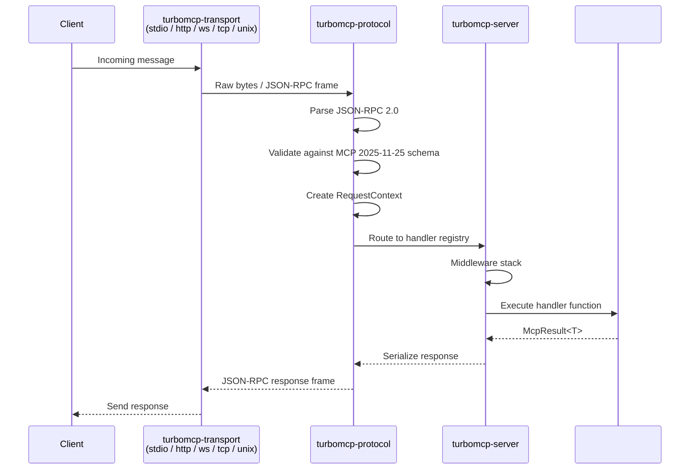

# TurboMCP Architecture

This document explains the modular architecture of **TurboMCP v3.0**, a high-performance Rust SDK for the Model Context Protocol (MCP).

## Overview

TurboMCP is built as a **layered architecture** with clear separation between foundational infrastructure and ergonomic developer APIs. This design enables both rapid prototyping and production-grade performance optimization.

```
┌──────────────────────────────────────────────────────────────────┐
│                   turbomcp (SDK / Ergonomic API)                 │
│         Re-exports everything. Zero-boilerplate entry point.     │
└──────────────────────────────────────────────────────────────────┘
┌────────────────────┐  ┌────────────────────┐  ┌────────────────┐
│  turbomcp-server   │  │  turbomcp-client   │  │ turbomcp-macros│
│  Request routing   │  │  Connection mgmt   │  │ #[server] etc. │
│  Middleware stack  │  │  Auto-retry / cap. │  │ Schema codegen │
└────────────────────┘  └────────────────────┘  └────────────────┘
┌──────────────────────────────────────────────────────────────────┐
│                      turbomcp-protocol                           │
│  JSON-RPC 2.0 · MCP 2025-11-25 · Session state · Schema valid.  │
└──────────────────────────────────────────────────────────────────┘
┌──────────────────────────────────────────────────────────────────┐
│                      turbomcp-transport                          │
│   Aggregator crate — re-exports individual transport crates      │
│   turbomcp-stdio · -http · -websocket · -tcp · -unix            │
└──────────────────────────────────────────────────────────────────┘
┌────────────────────────────┐  ┌───────────────────────────────┐
│  turbomcp-transport-traits │  │        turbomcp-types         │
│  Lean trait definitions    │  │  Unified MCP types (std only) │
│  (foundation layer)        │  │  Single source of truth       │
└────────────────────────────┘  └───────────────────────────────┘
┌──────────────────────────────────────────────────────────────────┐
│                       turbomcp-core                              │
│       no_std / alloc — core primitives, WASM-compatible          │
└──────────────────────────────────────────────────────────────────┘
```

## Crate Reference

### Foundation Layer

#### [`turbomcp-core`](./crates/turbomcp-core/)

The lowest-level crate. `no_std` compatible (with `alloc`) and WASM-safe. Provides core primitives and types used across the entire workspace. Enabled with `default = ["std"]`; disable std for embedded/WASM builds.

- `no_std` + `alloc` compatible, targeting WASM and WASI
- Optional `zero-copy` feature backed by `rkyv`
- Optional `rich-errors` feature adds UUID-tracked errors with timestamps

#### [`turbomcp-types`](./crates/turbomcp-types/)

The single authoritative source of all MCP message types, capability structs, and protocol enumerations. All higher-level crates depend on this rather than duplicating type definitions.

#### [`turbomcp-transport-traits`](./crates/turbomcp-transport-traits/)

Lean crate containing only transport trait definitions and the associated error types. Individual transport crates implement these traits. Nothing here pulls in network dependencies — it is safe to depend on without bloating compile times.

### Transport Layer

#### Individual Transport Crates

Each transport is a self-contained crate. Use the one you need; pay only for what you use.

| Crate | Protocol | Use Case |
|---|---|---|
| [`turbomcp-stdio`](./crates/turbomcp-stdio/) | STDIO | Local processes, subprocess servers |
| [`turbomcp-http`](./crates/turbomcp-http/) | HTTP/SSE | Web clients, Claude.ai, remote agents |
| [`turbomcp-websocket`](./crates/turbomcp-websocket/) | WebSocket | Real-time bidirectional communication |
| [`turbomcp-tcp`](./crates/turbomcp-tcp/) | TCP | Network socket communication |
| [`turbomcp-unix`](./crates/turbomcp-unix/) | Unix domain sockets | Local IPC (Linux/macOS) |

#### [`turbomcp-transport`](./crates/turbomcp-transport/)

Aggregator crate. Re-exports all individual transport crates behind feature flags (`stdio`, `http`, `websocket`, `tcp`, `unix`). Use this when you want multiple transports under a single dependency. Default feature is `stdio`.

### Protocol Layer

#### [`turbomcp-protocol`](./crates/turbomcp-protocol/)

Full MCP 2025-11-25 protocol implementation on top of the foundation layer.

```
Responsibilities:
├── JSON-RPC 2.0 message framing and dispatch
├── MCP 2025-11-25 specification
├── Protocol version negotiation (stable: 2025-11-25 and 2025-06-18; default accepts both)
├── SIMD-accelerated message processing (optional `simd` feature)
├── Request/Response context management
├── Session state management
├── Capability negotiation
├── JSON Schema validation (jsonschema)
└── Zero-copy message optimizations (Bytes)
```

**Note on v2 → v3:** In v2.0.0, the former `turbomcp-core` crate was merged into `turbomcp-protocol` to eliminate circular dependencies. In v3.0.0, `turbomcp-core` was re-extracted as a dedicated `no_std` foundation layer to support WASM targets, and `turbomcp-types` was introduced as the single authoritative type crate.

### Server and Client

#### [`turbomcp-server`](./crates/turbomcp-server/)

HTTP server implementation and request processing framework.

```
Responsibilities:
├── Handler registry and routing
├── Middleware stack processing
├── OAuth 2.1 authentication integration
├── Health checks and metrics endpoints
└── Graceful shutdown and connection draining
```

#### [`turbomcp-client`](./crates/turbomcp-client/)

MCP client with full connection lifecycle management.

```
Responsibilities:
├── Connection establishment across all transports
├── Request/response correlation
├── Configurable retry with exponential backoff
├── Capability negotiation on connect
└── Session lifecycle management
```

### Macro Layer

#### [`turbomcp-macros`](./crates/turbomcp-macros/)

Procedural macros for compile-time code generation and zero-boilerplate server development.

```
Macros:
├── #[server]   — Full server trait implementation and transport methods
├── #[tool]     — Tool handler registration + JSON schema generation
├── #[resource] — Resource handler registration
└── #[prompt]   — Prompt handler registration
```

Schema generation uses `schemars` and happens entirely at compile time — zero runtime overhead.

### SDK Crate

#### [`turbomcp`](./crates/turbomcp/)

The top-level SDK crate most developers depend on. Re-exports `turbomcp-protocol`, `turbomcp-server`, `turbomcp-client`, `turbomcp-macros`, and `turbomcp-transport` behind a unified `prelude`. This is the intended entry point for application authors.

### CLI

#### [`turbomcp-cli`](./crates/turbomcp-cli/)

Development and debugging utilities.

```
Commands:
├── tools list   — List available server tools
├── tools call   — Execute a tool with arguments
├── schema-export — Export JSON schemas
└── debug        — Protocol-level debugging
```

### Specialized Crates

These crates extend the SDK for specific deployment scenarios:

| Crate | Purpose |
|---|---|
| [`turbomcp-auth`](./crates/turbomcp-auth/) | OAuth 2.1 with PKCE; Google, GitHub, Microsoft providers |
| [`turbomcp-dpop`](./crates/turbomcp-dpop/) | RFC 9449 DPoP (Demonstration of Proof-of-Possession) |
| [`turbomcp-telemetry`](./crates/turbomcp-telemetry/) | OpenTelemetry integration (OTLP, Prometheus) |
| [`turbomcp-grpc`](./crates/turbomcp-grpc/) | gRPC transport via `tonic` |
| [`turbomcp-wasm`](./crates/turbomcp-wasm/) | WebAssembly bindings for browsers and WASI |
| [`turbomcp-wasm-macros`](./crates/turbomcp-wasm-macros/) | Proc macros for WASM server targets |
| [`turbomcp-wire`](./crates/turbomcp-wire/) | Wire format codec abstraction (JSON, MessagePack, CBOR) |
| [`turbomcp-openapi`](./crates/turbomcp-openapi/) | OpenAPI → MCP tool conversion |
| [`turbomcp-proxy`](./crates/turbomcp-proxy/) | Universal MCP adapter and code generation |
| [`turbomcp-transport-streamable`](./crates/turbomcp-transport-streamable/) | Streamable HTTP transport types |

## Data Flow



## Usage Patterns

### High-Level Ergonomic API (Recommended)

```rust
use turbomcp::prelude::*;

#[derive(Clone)]
struct MyServer;

#[server]
impl MyServer {
    #[tool("Example tool")]
    async fn my_tool(&self, input: String) -> McpResult<String> {
        Ok(format!("Processed: {}", input))
    }
}

#[tokio::main]
async fn main() -> Result<(), Box<dyn std::error::Error>> {
    MyServer.run_stdio().await?;
    Ok(())
}
```

### Context Injection

```rust
#[tool("Tool with request context")]
async fn context_tool(&self, ctx: &RequestContext, data: String) -> McpResult<String> {
    // ctx provides request correlation, transport info, and session state
    Ok(format!("Processed: {}", data))
}
```

### Transport Selection

```rust
// STDIO (default — subprocess / Claude Desktop)
server.run_stdio().await?;

// TCP
server.run_tcp("127.0.0.1:8080").await?;

// Unix domain socket
server.run_unix("/tmp/mcp.sock").await?;
```

## Performance Characteristics

### Optimization Features

- **SIMD Acceleration** — Optional `simd` feature enables `simd-json` and `sonic-rs` for accelerated JSON processing on supported CPUs
- **Zero-Copy Messages** — `Bytes` type throughout the message pipeline minimizes allocations
- **Connection Pooling** — Built into HTTP and TCP transports
- **Circuit Breakers** — Automatic fault tolerance in transport layer
- **Compile-Time Schemas** — `schemars`-based schema generation runs at compile time; zero runtime cost

### Build Profiles

| Profile | Use Case |
|---|---|
| `dev` | Development builds (opt-level 1, line-table debug info) |
| `release` | Production (fat LTO, single codegen unit, stripped) |
| `ci` | CI environments (thin LTO, size-optimized) |
| `wasm-release` | WASM targets (aggressive size optimization with `opt-level = "z"`) |
| `bench` | Benchmarking (release + debug info) |

## Crate Selection Guide

| Use Case | Recommended Approach | Crates Needed |
|---|---|---|
| Quick prototyping | High-level framework | `turbomcp` |
| Production application | Framework + selective transport | `turbomcp` + individual transport crates |
| Custom transport | Implement transport traits | `turbomcp-transport-traits` + `turbomcp-protocol` |
| WASM / browser target | Edge-native bindings | `turbomcp-wasm` + `turbomcp-wasm-macros` |
| Library integration | Specific components only | `turbomcp-protocol` + needed layers |
| Testing and debugging | CLI tools | `turbomcp-cli` |

## Dependency Graph (Simplified)

```
turbomcp
  └── turbomcp-macros
  └── turbomcp-server
        └── turbomcp-protocol
              └── turbomcp-types
              └── turbomcp-core (no_std)
  └── turbomcp-client
        └── turbomcp-protocol
  └── turbomcp-transport
        └── turbomcp-stdio
        └── turbomcp-http
        └── turbomcp-websocket
        └── turbomcp-tcp
        └── turbomcp-unix
              └── turbomcp-transport-traits
                    └── turbomcp-protocol
```

## Related Documentation

- **[Main README](./README.md)** — Getting started and overview
- **[Security Guide](./crates/turbomcp-transport/SECURITY_FEATURES.md)** — Enterprise security features
- **[API Documentation](https://docs.rs/turbomcp)** — Complete API reference
- **[Migration Guide](./MIGRATION.md)** — v1, v2, and v3 migration guide
