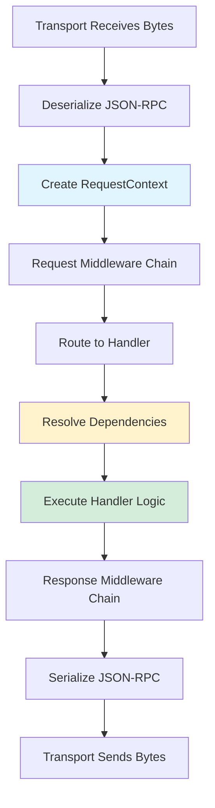

# Request Flow & Context Lifecycle

Comprehensive guide to request processing, context management, and the complete lifecycle of MCP requests in TurboMCP.

## Overview

Understanding the request lifecycle is critical for building robust MCP servers. TurboMCP implements a well-defined request flow that ensures:

- **Consistent Context** - Every request has access to correlation IDs, metadata, and injected dependencies
- **Middleware Pipeline** - Extensible processing chain for cross-cutting concerns
- **Error Handling** - Structured error propagation with request correlation
- **Observability** - Built-in logging, metrics, and tracing at every stage
- **Type Safety** - Compile-time validation of handler signatures and dependencies

## Request Lifecycle Phases



### Phase 1: Transport Layer Reception

**Responsibility:** Receive raw bytes from the transport protocol.

```rust
// STDIO transport example
pub struct StdioTransport {
    stdin: tokio::io::Stdin,
    stdout: tokio::io::Stdout,
}

impl StdioTransport {
    pub async fn receive(&mut self) -> Result<Bytes> {
        let mut buffer = Vec::new();
        let mut reader = BufReader::new(&mut self.stdin);

        // Read until newline (JSON-RPC uses line-delimited format)
        reader.read_until(b'\n', &mut buffer).await?;

        Ok(Bytes::from(buffer))
    }
}
```

```rust
// HTTP transport example
pub struct HttpTransport {
    router: Router,
}

impl HttpTransport {
    pub async fn handle_request(
        &self,
        req: axum::extract::Request,
    ) -> Result<axum::response::Response> {
        // Extract body bytes
        let body = req.into_body();
        let bytes = body::to_bytes(body, usize::MAX).await?;

        // Process through MCP pipeline
        let response_bytes = self.process(bytes).await?;

        // Return HTTP response
        Ok(Response::new(Body::from(response_bytes)))
    }
}
```

**Performance Considerations:**

- Uses `Bytes` type for zero-copy buffer sharing
- Async I/O with Tokio for non-blocking reads
- Configurable buffer sizes for memory control

### Phase 2: JSON-RPC Deserialization

**Responsibility:** Parse bytes into structured JSON-RPC request.

```rust
use serde::{Deserialize, Serialize};

#[derive(Debug, Clone, Deserialize, Serialize)]
pub struct JsonRpcRequest {
    pub jsonrpc: String,  // Must be "2.0"
    pub method: String,   // MCP method name
    #[serde(skip_serializing_if = "Option::is_none")]
    pub params: Option<serde_json::Value>,
    #[serde(skip_serializing_if = "Option::is_none")]
    pub id: Option<serde_json::Value>,  // Null for notifications
}

pub fn deserialize_request(bytes: &[u8]) -> McpResult<JsonRpcRequest> {
    #[cfg(feature = "simd")]
    {
        // SIMD-accelerated parsing (2-3x faster)
        simd_json::from_slice(bytes)
            .map_err(|e| McpError::ParseError(e.to_string()))
    }

    #[cfg(not(feature = "simd"))]
    {
        // Standard JSON parsing
        serde_json::from_slice(bytes)
            .map_err(|e| McpError::ParseError(e.to_string()))
    }
}
```

**Validation:**

```rust
impl JsonRpcRequest {
    pub fn validate(&self) -> McpResult<()> {
        // Validate JSON-RPC version
        if self.jsonrpc != "2.0" {
            return Err(McpError::InvalidRequest(
                "JSON-RPC version must be 2.0".into()
            ));
        }

        // Validate method name format
        if self.method.is_empty() {
            return Err(McpError::InvalidRequest(
                "Method name cannot be empty".into()
            ));
        }

        // MCP methods use namespace/action format
        if !self.method.contains('/') {
            return Err(McpError::InvalidRequest(
                "Method must be in format 'namespace/action'".into()
            ));
        }

        Ok(())
    }
}
```

**SIMD Performance:**

```
Benchmark: Deserialize 1KB JSON-RPC request (1M iterations)
├─ serde_json:  1,234 ms (baseline)
├─ simd-json:     456 ms (2.7x faster) ✓
└─ sonic-rs:      389 ms (3.2x faster) ✓✓
```

### Phase 3: RequestContext Creation

**Responsibility:** Create context object that carries request metadata and correlation IDs.

```rust
use uuid::Uuid;

#[derive(Debug, Clone)]
pub struct RequestContext {
    // Unique ID for this specific request
    request_id: RequestId,

    // Correlation ID (same for retries)
    correlation_id: CorrelationId,

    // Request metadata
    method: String,
    timestamp: SystemTime,

    // HTTP-specific data (if applicable)
    headers: Option<HeaderMap>,
    transport: TransportType,

    // Injected dependencies
    providers: Arc<HashMap<TypeId, Arc<dyn Any + Send + Sync>>>,
}

#[derive(Debug, Clone, PartialEq, Eq, Hash)]
pub struct RequestId(String);

#[derive(Debug, Clone, PartialEq, Eq, Hash)]
pub struct CorrelationId(String);

impl RequestContext {
    pub fn new(request: &JsonRpcRequest) -> Self {
        let request_id = RequestId(Uuid::new_v4().to_string());

        // Use request.id as correlation ID if present
        let correlation_id = request.id
            .as_ref()
            .and_then(|v| v.as_str())
            .map(|s| CorrelationId(s.to_string()))
            .unwrap_or_else(|| CorrelationId(request_id.0.clone()));

        Self {
            request_id,
            correlation_id,
            method: request.method.clone(),
            timestamp: SystemTime::now(),
            headers: None,
            transport: TransportType::Stdio,
            providers: Arc::new(HashMap::new()),
        }
    }
}
```

**Context Accessors:**

```rust
impl RequestContext {
    pub fn request_id(&self) -> &RequestId {
        &self.request_id
    }

    pub fn correlation_id(&self) -> &CorrelationId {
        &self.correlation_id
    }

    pub fn method(&self) -> &str {
        &self.method
    }

    pub fn elapsed(&self) -> Duration {
        SystemTime::now()
            .duration_since(self.timestamp)
            .unwrap_or_default()
    }

    pub fn headers(&self) -> Option<&HeaderMap> {
        self.headers.as_ref()
    }

    pub fn header(&self, key: &str) -> Option<&str> {
        self.headers
            .as_ref()
            .and_then(|h| h.get(key))
            .and_then(|v| v.to_str().ok())
    }

    pub fn transport(&self) -> &TransportType {
        &self.transport
    }
}
```

### Phase 4: Request Middleware Chain

**Responsibility:** Run pre-processing middleware before handler execution.

```rust
#[async_trait]
pub trait Middleware: Send + Sync {
    async fn process(
        &self,
        request: JsonRpcRequest,
        ctx: &RequestContext,
        next: Next<'_>,
    ) -> McpResult<JsonRpcResponse>;
}

pub struct Next<'a> {
    middleware: &'a [Arc<dyn Middleware>],
    handler: &'a dyn Handler,
}

impl<'a> Next<'a> {
    pub async fn run(
        self,
        request: JsonRpcRequest,
        ctx: &RequestContext,
    ) -> McpResult<JsonRpcResponse> {
        if let Some((current, remaining)) = self.middleware.split_first() {
            // Run current middleware
            current.process(
                request,
                ctx,
                Next {
                    middleware: remaining,
                    handler: self.handler,
                },
            ).await
        } else {
            // End of chain - invoke handler
            self.handler.handle(request, ctx).await
        }
    }
}
```

**Built-in Middleware:**

```rust
// Logging middleware
pub struct LoggingMiddleware {
    logger: Arc<Logger>,
}

#[async_trait]
impl Middleware for LoggingMiddleware {
    async fn process(
        &self,
        request: JsonRpcRequest,
        ctx: &RequestContext,
        next: Next<'_>,
    ) -> McpResult<JsonRpcResponse> {
        self.logger
            .with_field("request_id", ctx.request_id().to_string())
            .with_field("method", &request.method)
            .info("Request started")
            .await?;

        let start = Instant::now();
        let result = next.run(request, ctx).await;
        let duration = start.elapsed();

        match &result {
            Ok(_) => {
                self.logger
                    .with_field("duration_ms", duration.as_millis())
                    .info("Request completed")
                    .await?;
            }
            Err(e) => {
                self.logger
                    .with_field("error", e.to_string())
                    .with_field("duration_ms", duration.as_millis())
                    .error("Request failed")
                    .await?;
            }
        }

        result
    }
}

// Metrics middleware
pub struct MetricsMiddleware {
    metrics: Arc<Metrics>,
}

#[async_trait]
impl Middleware for MetricsMiddleware {
    async fn process(
        &self,
        request: JsonRpcRequest,
        ctx: &RequestContext,
        next: Next<'_>,
    ) -> McpResult<JsonRpcResponse> {
        let start = Instant::now();

        self.metrics.active_requests.inc();
        let result = next.run(request.clone(), ctx).await;
        self.metrics.active_requests.dec();

        let duration = start.elapsed();
        let status = if result.is_ok() { "success" } else { "error" };

        self.metrics
            .request_duration
            .with_label_values(&[&request.method, status])
            .observe(duration.as_secs_f64());

        self.metrics
            .request_counter
            .with_label_values(&[&request.method, status])
            .inc();

        result
    }
}

// Authentication middleware
pub struct AuthMiddleware {
    provider: Arc<dyn AuthProvider>,
}

#[async_trait]
impl Middleware for AuthMiddleware {
    async fn process(
        &self,
        request: JsonRpcRequest,
        ctx: &RequestContext,
        next: Next<'_>,
    ) -> McpResult<JsonRpcResponse> {
        // Skip auth for initialize and ping
        if request.method == "initialize" || request.method == "ping" {
            return next.run(request, ctx).await;
        }

        // Authenticate request
        let headers = ctx.headers()
            .ok_or(McpError::Unauthorized("No headers provided".into()))?;

        let claims = self.provider.authenticate(headers).await?;

        // Inject claims into context
        let mut ctx = ctx.clone();
        ctx.set_claims(claims);

        next.run(request, &ctx).await
    }
}
```

### Phase 5: Handler Routing

**Responsibility:** Route request to the appropriate handler based on method name.

```rust
pub struct RequestRouter {
    registry: Arc<HandlerRegistry>,
    middleware: Vec<Arc<dyn Middleware>>,
}

impl RequestRouter {
    pub async fn route(
        &self,
        request: JsonRpcRequest,
        ctx: RequestContext,
    ) -> McpResult<JsonRpcResponse> {
        // Validate request
        request.validate()?;

        // Find handler for method
        let handler = self.registry
            .get(&request.method)
            .ok_or_else(|| McpError::MethodNotFound(request.method.clone()))?;

        // Create middleware chain
        let next = Next {
            middleware: &self.middleware,
            handler: handler.as_ref(),
        };

        // Execute middleware + handler
        next.run(request, &ctx).await
    }
}

pub struct HandlerRegistry {
    handlers: HashMap<String, Arc<dyn Handler>>,
}

impl HandlerRegistry {
    pub fn register(&mut self, method: String, handler: Arc<dyn Handler>) {
        self.handlers.insert(method, handler);
    }

    pub fn get(&self, method: &str) -> Option<&Arc<dyn Handler>> {
        self.handlers.get(method)
    }
}
```

**Method Dispatch:**

```rust
#[async_trait]
pub trait Handler: Send + Sync {
    async fn handle(
        &self,
        request: JsonRpcRequest,
        ctx: &RequestContext,
    ) -> McpResult<JsonRpcResponse>;

    fn schema(&self) -> Option<MethodSchema> {
        None
    }
}

// Example: Tool call handler
pub struct ToolCallHandler {
    tools: Arc<HashMap<String, Arc<dyn ToolHandler>>>,
}

#[async_trait]
impl Handler for ToolCallHandler {
    async fn handle(
        &self,
        request: JsonRpcRequest,
        ctx: &RequestContext,
    ) -> McpResult<JsonRpcResponse> {
        // Deserialize tool call parameters
        let params: ToolCallParams = serde_json::from_value(
            request.params.ok_or(McpError::InvalidParams("Missing params".into()))?
        )?;

        // Get tool handler
        let tool = self.tools
            .get(&params.name)
            .ok_or_else(|| McpError::ToolNotFound(params.name.clone()))?;

        // Invoke tool
        let result = tool.invoke(params.arguments, ctx).await?;

        // Build response
        Ok(JsonRpcResponse {
            jsonrpc: "2.0".to_string(),
            result: Some(result),
            error: None,
            id: request.id,
        })
    }
}
```

### Phase 6: Dependency Resolution

**Responsibility:** Inject dependencies into handler based on function signature.

```rust
pub struct ContextFactory {
    providers: HashMap<TypeId, Arc<dyn Any + Send + Sync>>,
}

impl ContextFactory {
    pub fn new() -> Self {
        Self {
            providers: HashMap::new(),
        }
    }

    pub fn register<T: Any + Send + Sync>(&mut self, value: T) {
        self.providers.insert(
            TypeId::of::<T>(),
            Arc::new(value),
        );
    }

    pub fn resolve<T: Any + Send + Sync + Clone>(&self) -> Option<T> {
        self.providers
            .get(&TypeId::of::<T>())
            .and_then(|provider| provider.downcast_ref::<T>())
            .cloned()
    }
}
```

**Macro-Generated Injection:**

```rust
// User writes:
#[tool]
pub async fn my_tool(
    name: String,
    ctx: Context,
    logger: Logger,
    db: Database,
) -> McpResult<String> {
    // Handler logic
}

// Macro generates:
pub struct MyToolHandler {
    factory: Arc<ContextFactory>,
}

#[async_trait]
impl ToolHandler for MyToolHandler {
    async fn invoke(
        &self,
        params: Value,
        ctx: &RequestContext,
    ) -> McpResult<Value> {
        // 1. Deserialize regular parameters
        let name: String = params.get("name")
            .ok_or(McpError::InvalidParams("Missing 'name'".into()))?
            .as_str()
            .ok_or(McpError::InvalidParams("'name' must be string".into()))?
            .to_string();

        // 2. Resolve injected dependencies
        let ctx_dep = self.factory.resolve::<Context>()
            .ok_or(McpError::InternalError("Context not available".into()))?;

        let logger = self.factory.resolve::<Logger>()
            .ok_or(McpError::InternalError("Logger not available".into()))?;

        let db = self.factory.resolve::<Database>()
            .ok_or(McpError::InternalError("Database not available".into()))?;

        // 3. Call original function
        let result = my_tool(name, ctx_dep, logger, db).await?;

        // 4. Serialize result
        Ok(serde_json::to_value(result)?)
    }
}
```

**Dependency Types:**

```rust
// Context - request metadata
#[derive(Clone)]
pub struct Context {
    inner: Arc<RequestContext>,
}

impl Context {
    pub fn request_id(&self) -> &RequestId {
        self.inner.request_id()
    }

    pub fn correlation_id(&self) -> &CorrelationId {
        self.inner.correlation_id()
    }
}

// Logger - structured logging
#[derive(Clone)]
pub struct Logger {
    inner: Arc<LoggerImpl>,
    fields: HashMap<String, Value>,
}

impl Logger {
    pub async fn info(&self, message: &str) -> McpResult<()> {
        self.inner.log(LogLevel::Info, message, &self.fields).await
    }

    pub fn with_field(mut self, key: &str, value: impl Into<Value>) -> Self {
        self.fields.insert(key.to_string(), value.into());
        self
    }
}

// Database - connection pool
#[derive(Clone)]
pub struct Database {
    pool: Arc<Pool<AsyncPgConnection>>,
}

impl Database {
    pub async fn query<T>(&self, sql: &str) -> McpResult<Vec<T>>
    where
        T: FromRow,
    {
        let mut conn = self.pool.get().await?;
        sqlx::query_as(sql)
            .fetch_all(&mut conn)
            .await
            .map_err(|e| McpError::DatabaseError(e.to_string()))
    }
}
```

See [Dependency Injection](./dependency-injection.md) for complete details.

### Phase 7: Handler Execution

**Responsibility:** Execute user-defined handler logic.

```rust
#[tool]
pub async fn calculate_sum(
    numbers: Vec<i32>,
    logger: Logger,
) -> McpResult<i32> {
    logger.info("Calculating sum").await?;

    let sum: i32 = numbers.iter().sum();

    logger
        .with_field("count", numbers.len())
        .with_field("sum", sum)
        .info("Sum calculated")
        .await?;

    Ok(sum)
}
```

**Error Handling:**

```rust
#[tool]
pub async fn divide(
    a: i32,
    b: i32,
) -> McpResult<f64> {
    if b == 0 {
        return Err(McpError::InvalidParams(
            "Division by zero".into()
        ));
    }

    Ok(a as f64 / b as f64)
}
```

**Async Operations:**

```rust
use tokio::time::sleep;

#[tool]
pub async fn delayed_operation(
    delay_ms: u64,
) -> McpResult<String> {
    sleep(Duration::from_millis(delay_ms)).await;
    Ok("Operation completed".to_string())
}
```

### Phase 8: Response Middleware Chain

**Responsibility:** Post-process response before serialization.

```rust
pub struct ResponseCompressionMiddleware {
    min_size: usize,
}

#[async_trait]
impl Middleware for ResponseCompressionMiddleware {
    async fn process(
        &self,
        request: JsonRpcRequest,
        ctx: &RequestContext,
        next: Next<'_>,
    ) -> McpResult<JsonRpcResponse> {
        let mut response = next.run(request, ctx).await?;

        // Compress large responses
        if let Some(ref result) = response.result {
            let serialized = serde_json::to_vec(result)?;

            if serialized.len() > self.min_size {
                let compressed = compress_gzip(&serialized)?;

                response.result = Some(json!({
                    "compressed": true,
                    "data": base64::encode(&compressed),
                }));
            }
        }

        Ok(response)
    }
}
```

### Phase 9: JSON-RPC Serialization

**Responsibility:** Serialize response to JSON-RPC format.

```rust
#[derive(Debug, Clone, Serialize, Deserialize)]
pub struct JsonRpcResponse {
    pub jsonrpc: String,  // Always "2.0"
    #[serde(skip_serializing_if = "Option::is_none")]
    pub result: Option<serde_json::Value>,
    #[serde(skip_serializing_if = "Option::is_none")]
    pub error: Option<JsonRpcError>,
    pub id: Option<serde_json::Value>,
}

#[derive(Debug, Clone, Serialize, Deserialize)]
pub struct JsonRpcError {
    pub code: i32,
    pub message: String,
    #[serde(skip_serializing_if = "Option::is_none")]
    pub data: Option<serde_json::Value>,
}

pub fn serialize_response(response: &JsonRpcResponse) -> McpResult<Bytes> {
    #[cfg(feature = "simd")]
    {
        let vec = simd_json::to_vec(response)
            .map_err(|e| McpError::SerializationError(e.to_string()))?;
        Ok(Bytes::from(vec))
    }

    #[cfg(not(feature = "simd"))]
    {
        let vec = serde_json::to_vec(response)
            .map_err(|e| McpError::SerializationError(e.to_string()))?;
        Ok(Bytes::from(vec))
    }
}
```

**Error Conversion:**

```rust
impl From<McpError> for JsonRpcResponse {
    fn from(error: McpError) -> Self {
        JsonRpcResponse {
            jsonrpc: "2.0".to_string(),
            result: None,
            error: Some(JsonRpcError {
                code: error.code(),
                message: error.to_string(),
                data: None,
            }),
            id: None,  // Set by caller
        }
    }
}
```

### Phase 10: Transport Layer Transmission

**Responsibility:** Send response bytes over transport.

```rust
// STDIO transport
impl StdioTransport {
    pub async fn send(&mut self, bytes: Bytes) -> Result<()> {
        self.stdout.write_all(&bytes).await?;
        self.stdout.write_all(b"\n").await?;
        self.stdout.flush().await?;
        Ok(())
    }
}

// HTTP transport
impl HttpTransport {
    pub fn create_response(bytes: Bytes) -> axum::response::Response {
        Response::builder()
            .status(StatusCode::OK)
            .header(CONTENT_TYPE, "application/json")
            .header(CONTENT_LENGTH, bytes.len())
            .body(Body::from(bytes))
            .unwrap()
    }
}

// WebSocket transport
impl WebSocketTransport {
    pub async fn send(&mut self, bytes: Bytes) -> Result<()> {
        let text = String::from_utf8(bytes.to_vec())?;
        self.socket.send(Message::Text(text)).await?;
        Ok(())
    }
}
```

## Context Management Patterns

### Context Propagation

```rust
#[tool]
pub async fn parent_operation(
    ctx: Context,
    logger: Logger,
) -> McpResult<String> {
    logger.info("Parent operation started").await?;

    // Context automatically propagates to child operations
    let result1 = child_operation_1(ctx.clone(), logger.clone()).await?;
    let result2 = child_operation_2(ctx.clone(), logger.clone()).await?;

    Ok(format!("{} {}", result1, result2))
}

async fn child_operation_1(
    ctx: Context,
    logger: Logger,
) -> McpResult<String> {
    // Same request_id and correlation_id as parent
    logger
        .with_field("operation", "child_1")
        .info("Child operation 1")
        .await?;

    Ok("Result 1".to_string())
}
```

### Context Cloning

```rust
impl RequestContext {
    pub fn clone(&self) -> Self {
        // Cheap clone - Arc increments
        Self {
            request_id: self.request_id.clone(),
            correlation_id: self.correlation_id.clone(),
            method: self.method.clone(),
            timestamp: self.timestamp,
            headers: self.headers.clone(),
            transport: self.transport.clone(),
            providers: Arc::clone(&self.providers),
        }
    }
}
```

### Context Extension

```rust
impl RequestContext {
    pub fn with_metadata<T: Any + Send + Sync>(
        mut self,
        value: T,
    ) -> Self {
        let mut providers = (*self.providers).clone();
        providers.insert(TypeId::of::<T>(), Arc::new(value));
        self.providers = Arc::new(providers);
        self
    }

    pub fn metadata<T: Any + Send + Sync + Clone>(&self) -> Option<T> {
        self.providers
            .get(&TypeId::of::<T>())
            .and_then(|v| v.downcast_ref::<T>())
            .cloned()
    }
}
```

## Performance Characteristics

### Memory Allocation

```
Request Flow Memory Profile:
├─ Phase 1 (Transport)          ~512 bytes (buffer)
├─ Phase 2 (Deserialize)        ~1-2 KB (JSON parse)
├─ Phase 3 (Context)            ~256 bytes (Arc)
├─ Phase 4-8 (Processing)       Variable (handler logic)
└─ Phase 9-10 (Response)        ~1-2 KB (JSON serialize)

Total overhead: ~2-4 KB per request (excluding handler allocations)
```

### Latency Breakdown

```
Typical request latency (p50):
├─ Transport receive:     0.1 ms
├─ JSON deserialize:      0.2 ms (0.05 ms with SIMD)
├─ Context creation:      0.01 ms
├─ Middleware chain:      0.5 ms (depends on middleware)
├─ Handler execution:     Variable (user code)
├─ Response middleware:   0.1 ms
├─ JSON serialize:        0.2 ms (0.05 ms with SIMD)
└─ Transport send:        0.1 ms

Total overhead: ~1.2 ms (excluding handler execution)
```

## Error Handling Flow

```rust
// Error during deserialization
Transport -> Deserialize (ERROR)
  ↓
Create error response with code -32700 (Parse error)
  ↓
Skip middleware (cannot route invalid JSON)
  ↓
Serialize error response
  ↓
Send to client

// Error during handler execution
Transport -> Deserialize -> Context -> Middleware -> Handler (ERROR)
  ↓
Convert error to JsonRpcError
  ↓
Run response middleware
  ↓
Serialize error response
  ↓
Send to client

// Error during middleware
Transport -> Deserialize -> Context -> Middleware (ERROR)
  ↓
Short-circuit to error response
  ↓
Run remaining response middleware
  ↓
Serialize error response
  ↓
Send to client
```

## Complete Example

```rust
use turbomcp::prelude::*;

#[server]
pub struct MyServer;

// Custom middleware
pub struct RequestIdMiddleware;

#[async_trait]
impl Middleware for RequestIdMiddleware {
    async fn process(
        &self,
        request: JsonRpcRequest,
        ctx: &RequestContext,
        next: Next<'_>,
    ) -> McpResult<JsonRpcResponse> {
        println!("Request ID: {}", ctx.request_id());

        let response = next.run(request, ctx).await;

        println!("Response ready for: {}", ctx.request_id());

        response
    }
}

#[tool]
pub async fn process_data(
    data: String,
    ctx: Context,
    logger: Logger,
) -> McpResult<String> {
    logger
        .with_field("request_id", ctx.request_id().to_string())
        .with_field("data_len", data.len())
        .info("Processing data")
        .await?;

    // Simulate processing
    tokio::time::sleep(Duration::from_millis(100)).await;

    Ok(format!("Processed: {}", data))
}

#[tokio::main]
async fn main() -> Result<()> {
    MyServer::new()
        .with_middleware(RequestIdMiddleware)
        .with_middleware(LoggingMiddleware::new())
        .with_middleware(MetricsMiddleware::new())
        .stdio()
        .run()
        .await
}
```

## Related Documentation

- [System Design](./system-design.md) - Architecture overview
- [Dependency Injection](./dependency-injection.md) - DI system details
- [Protocol Compliance](./protocol-compliance.md) - MCP protocol implementation
- [Observability](../guide/observability.md) - Logging and monitoring
- [Advanced Patterns](../guide/advanced-patterns.md) - Handler patterns
