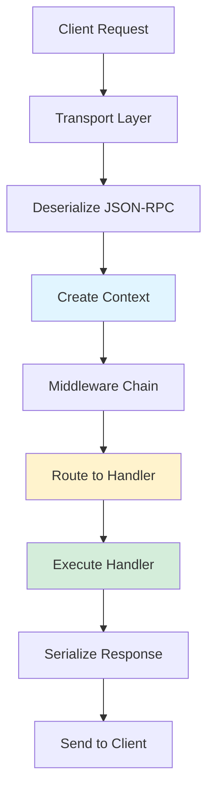
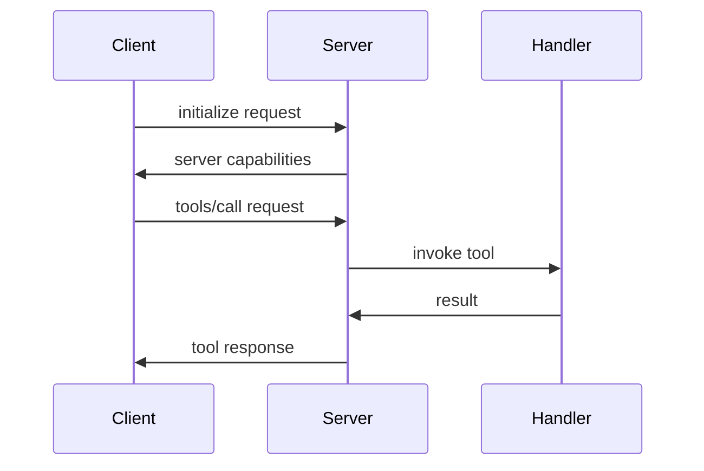
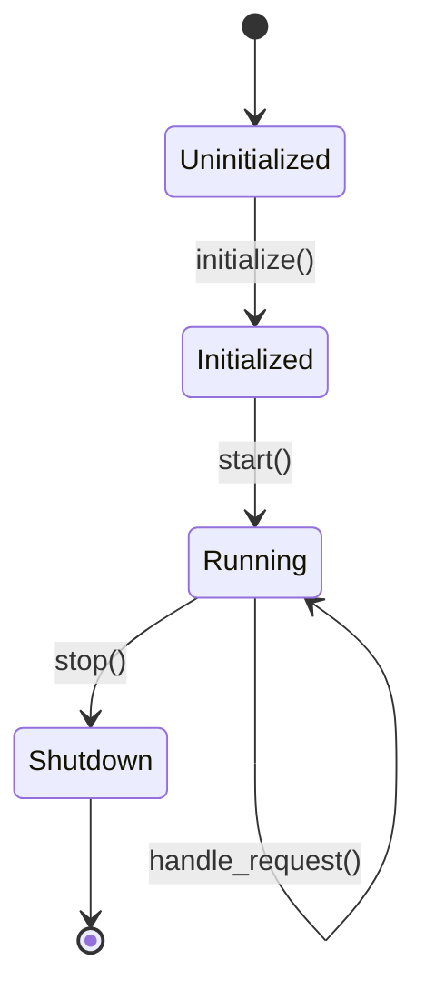

# Documentation Guidelines

Comprehensive guide to writing, organizing, and maintaining TurboMCP documentation.

## Overview

Good documentation is essential for TurboMCP's success. This guide covers:

- **Documentation Philosophy** - Our principles and goals
- **Content Structure** - How to organize documentation
- **Writing Style** - Voice, tone, and formatting
- **Code Examples** - Best practices for examples
- **Review Process** - Getting documentation reviewed
- **Tools and Automation** - Helpful documentation tools

## Documentation Philosophy

### Principles

**1. User-First**
- Write for your audience (beginners, experts, or both)
- Answer "why" not just "how"
- Provide context and use cases

**2. Progressive Disclosure**
- Start simple, add complexity gradually
- Quick start guides first, advanced topics later
- Layer information from high-level to detailed

**3. Show, Don't Tell**
- Code examples over lengthy prose
- Diagrams for complex concepts
- Real-world scenarios

**4. Maintainability**
- Keep examples testable
- Cross-reference related docs
- Update with code changes

**5. Accessibility**
- Clear, simple language
- Avoid jargon (or explain it)
- Inclusive examples

### Documentation Types

**1. Guides** (`docs/guide/`)
- Tutorial-style content
- Step-by-step instructions
- For learning and exploration

**Examples:**
- Getting Started
- Building Your First Server
- Deployment Guide

**2. Reference** (`docs/reference/`)
- API documentation
- Configuration reference
- Type definitions

**Examples:**
- API Reference
- Configuration Options
- Error Codes

**3. Architecture** (`docs/architecture/`)
- Design decisions
- Internal implementation
- Technical deep dives

**Examples:**
- System Design
- Protocol Compliance
- Dependency Injection

**4. How-To** (`docs/how-to/`)
- Task-focused recipes
- Problem-solution format
- Specific use cases

**Examples:**
- How to Add Authentication
- How to Implement Caching
- How to Deploy to AWS

**5. Contributing** (`docs/contributing/`)
- Development workflow
- Code standards
- Release process

**Examples:**
- Code of Conduct
- Development Guide
- Documentation Guide (this document)

## Content Structure

### Page Template

```markdown
# Page Title

Brief one-sentence description of what this page covers.

## Overview

Paragraph explaining:
- What this feature/topic is
- Why it's useful
- When to use it

## Quick Start

Minimal working example to get started immediately.

\`\`\`rust
// Simplest possible example
use turbomcp::prelude::*;

#[server]
pub struct MyServer;
\`\`\`

## Basic Usage

Common patterns and straightforward use cases.

### Section 1

Explanation with example.

### Section 2

Explanation with example.

## Advanced Usage

Complex scenarios and edge cases.

## Configuration

Available options with defaults.

## Best Practices

Recommendations and pitfalls to avoid.

## Troubleshooting

Common issues and solutions.

## Related Documentation

- [Related Topic 1](./topic1.md)
- [Related Topic 2](./topic2.md)
```

### Section Organization

**Good:**

```markdown
## Dependency Injection

### Overview

TurboMCP provides compile-time dependency injection...

### Injectable Types

Built-in types you can inject:

#### Context

Request metadata and correlation IDs.

\`\`\`rust
#[tool]
pub async fn my_tool(ctx: Context) -> McpResult<String> {
    // ...
}
\`\`\`

#### Logger

Structured logging with correlation.

\`\`\`rust
#[tool]
pub async fn my_tool(logger: Logger) -> McpResult<String> {
    // ...
}
\`\`\`

### Custom Dependencies

Register your own types...
```

**Bad:**

```markdown
## Dependency Injection

You can inject dependencies into tools. Here's how:

[Giant wall of text with no structure]

[Code example with no context]

[Another wall of text]
```

### Headings Hierarchy

```markdown
# Page Title (H1) - Only one per page
## Major Section (H2)
### Subsection (H3)
#### Minor Point (H4)
```

**Don't skip levels:**

```markdown
# Title
### Subsection  ❌ WRONG - skipped H2
## Section      ✓ CORRECT
```

## Writing Style

### Voice and Tone

**Active Voice:**

```markdown
✓ "The server processes requests"
✗ "Requests are processed by the server"

✓ "You can configure the timeout"
✗ "The timeout can be configured"
```

**Direct Address:**

```markdown
✓ "You register tools using the #[tool] macro"
✗ "One registers tools using the #[tool] macro"
✗ "Tools are registered using the #[tool] macro"
```

**Present Tense:**

```markdown
✓ "The server handles incoming requests"
✗ "The server will handle incoming requests"
```

### Clarity

**Simple Language:**

```markdown
✓ "Use the Context to access request metadata"
✗ "Utilize the Context abstraction to facilitate access to request metadata"

✓ "This improves performance"
✗ "This engenders performance enhancements"
```

**Explain Jargon:**

```markdown
✓ "Middleware (code that runs before/after handlers) processes requests"
✗ "Middleware processes requests"  # Only if already defined

✓ "The server uses Arc (atomic reference counting) for thread-safe sharing"
✗ "The server uses Arc for sharing"  # Explain on first use
```

**Short Sentences:**

```markdown
✓ "The server validates requests. Invalid requests return an error."
✗ "The server validates requests, and if a request is invalid, it returns an error indicating the nature of the validation failure."
```

### Formatting

**Bold for Emphasis:**

```markdown
**Important:** Always validate user input.

The server supports **three** transport protocols.
```

**Italic for Terms:**

```markdown
The *handler registry* maps method names to functions.

Use the *type-state pattern* to enforce compile-time correctness.
```

**Code Formatting:**

```markdown
Use `inline code` for identifiers, types, and short snippets.

The `McpServer` struct provides the main API.
Set `tool_list_changed` to `true` to enable notifications.
```

**Lists:**

```markdown
Unordered lists for options:
- Option A
- Option B
- Option C

Ordered lists for steps:
1. First step
2. Second step
3. Third step

Nested lists:
- Category 1
  - Subcategory 1a
  - Subcategory 1b
- Category 2
```

## Code Examples

### Example Quality

**Good Example:**

```rust
use turbomcp::prelude::*;

#[derive(Clone)]
pub struct MathServer;

#[server(name = "math", version = "1.0.0")]
impl MathServer {
    /// Calculate the sum of numbers.
    #[tool]
    async fn calculate_sum(
        &self,
        #[description("Numbers to sum")]
        numbers: Vec<f64>,
    ) -> McpResult<f64> {
        Ok(numbers.iter().sum())
    }
}
```

**What Makes It Good:**
- Self-contained (includes imports)
- Realistic (actual use case)
- Commented (explains what it does)
- Typed (shows parameter types)
- Complete (includes error handling)

**Bad Example:**

```rust
fn sum(v: Vec<f64>) -> f64 {
    v.iter().sum()
}
```

**What's Wrong:**
- No context (where does this go?)
- No imports (won't compile standalone)
- Not idiomatic (doesn't use Result)
- No documentation (what does it do?)

### Example Patterns

**Quick Start Example:**

```rust
// Minimal viable example
use turbomcp::prelude::*;

#[derive(Clone)]
pub struct MyServer;

#[server(name = "my-server", version = "1.0.0")]
impl MyServer {
    /// Say hello
    #[tool]
    async fn hello(&self, name: String) -> McpResult<String> {
        Ok(format!("Hello, {}!", name))
    }
}
```

**Intermediate Example:**

```rust
// Realistic example with common features: shared state, a cache,
// parameter descriptions, and error handling
use std::collections::HashMap;
use std::sync::Arc;
use tokio::sync::RwLock;
use turbomcp::prelude::*;

#[derive(Clone, Serialize, Deserialize)]
pub struct User {
    pub id: String,
    pub name: String,
}

#[derive(Clone, Default)]
pub struct UserServer {
    users: Arc<RwLock<HashMap<String, User>>>,
    cache: Arc<RwLock<HashMap<String, User>>>,
}

#[server(name = "users", version = "1.0.0")]
impl UserServer {
    /// Fetch a user profile
    #[tool(read_only = true)]
    async fn get_user(
        &self,
        #[description("User ID")]
        user_id: String,
    ) -> McpResult<String> {
        // Try cache first
        if let Some(user) = self.cache.read().await.get(&user_id) {
            return Ok(user.name.clone());
        }

        // Fall back to the store
        let user = self
            .users
            .read()
            .await
            .get(&user_id)
            .cloned()
            .ok_or_else(|| McpError::invalid_params(format!("no user {user_id}")))?;

        // Cache result
        self.cache.write().await.insert(user_id, user.clone());
        Ok(user.name)
    }
}
```

**Advanced Example:**

```rust
// Complex scenario with validation, tracing, progress, and cancellation
use std::sync::Arc;
use tokio::sync::Mutex;
use tracing::{info, instrument};
use turbomcp::prelude::*;

#[derive(Clone, Default)]
pub struct PaymentServer {
    paid_orders: Arc<Mutex<Vec<String>>>,
}

#[server(name = "payments", version = "1.0.0")]
impl PaymentServer {
    /// Process a payment for an order
    #[tool(destructive = true)]
    #[instrument(skip(self, ctx))]
    async fn process_payment(
        &self,
        #[description("Order to charge")] order_id: String,
        #[description("Amount, in the order's currency")] amount: f64,
        ctx: &RequestContext,
    ) -> McpResult<String> {
        // Validate input: reported to the model as a tool error it can correct
        if amount <= 0.0 {
            return Err(McpError::invalid_params("Amount must be positive"));
        }

        let mut paid = self.paid_orders.lock().await;
        if paid.contains(&order_id) {
            return Err(McpError::invalid_params(format!("Order {order_id} is already paid")));
        }

        // Honour cancellation before the irreversible step
        if ctx.is_cancelled() {
            return Err(McpError::cancelled("payment cancelled by client"));
        }
        ctx.report_progress(0.5, Some(1.0), Some("charging")).await?;

        paid.push(order_id.clone());
        info!(%order_id, amount, "payment processed");
        Ok(format!("Charged {amount:.2} for order {order_id}"))
    }
}
```

### Testing Examples

All examples should be testable:

**Testable Example:**

````markdown
```rust
use turbomcp::prelude::*;

#[derive(Clone)]
pub struct Calculator;

#[server]
impl Calculator {
    /// Add two numbers
    #[tool]
    async fn add(&self, a: i32, b: i32) -> McpResult<i32> {
        Ok(a + b)
    }
}

# #[tokio::test]
# async fn test_add() {
#     assert_eq!(Calculator.add(2, 3).await.unwrap(), 5);
# }
```
````

In rustdoc, lines starting with `# ` are hidden from the rendered docs but still compiled and run by `cargo test --doc`. The mkdocs site does not hide them.

**Testing:**

```bash
# Test documentation examples
cargo test --doc
```

### Configuration Examples

**Show defaults:**

```rust
use std::time::Duration;
use turbomcp::prelude::*;
use turbomcp_server::{ConnectionLimits, RateLimitConfig};

let config = ServerConfig::builder()
    // Largest accepted message, in bytes.   Default: 10 MB
    .max_message_size(1024 * 1024)
    // Per-client rate limit.                Default: none
    .rate_limit(RateLimitConfig::new(100, Duration::from_secs(1)))
    // Concurrent connections per transport. Default: 1000
    .connection_limits(ConnectionLimits::default())
    // Idle HTTP sessions are reaped after.  Default: 1 hour
    .http_session_idle_timeout(Duration::from_secs(30 * 60))
    .build();
```

**Show common patterns:**

```rust
use std::time::Duration;
use turbomcp::prelude::*;

// Defaults: multi-version protocol negotiation, no rate limit,
// localhost origins only
let default_config = ServerConfig::default();

// Validated custom config: `try_build` rejects impossible values
let custom_config = ServerConfig::builder()
    .max_message_size(4 * 1024 * 1024)
    .allow_origin("https://app.example.com")
    .try_build()
    .expect("valid configuration");

// Or configure through the server builder
#[derive(Clone)]
struct MyServer;

#[server]
impl MyServer {
    /// Say hello
    #[tool]
    async fn hello(&self) -> String {
        "hello".into()
    }
}

let builder = MyServer
    .builder()
    .with_connection_limit(5000)
    .with_rate_limit(100, Duration::from_secs(1));
```

## Diagrams

### When to Use Diagrams

**Good Use Cases:**
- System architecture
- Request flow
- State transitions
- Component relationships

**Bad Use Cases:**
- Simple lists (use markdown lists)
- Linear processes (use numbered steps)
- Type hierarchies (use code)

### Mermaid Diagrams

**Flow Charts:**

````markdown

```mermaid
graph TD
    A[Client Request] --> B[Transport Layer]
    B --> C[Deserialize JSON-RPC]
    C --> D[Create Context]
    D --> E[Middleware Chain]
    E --> F[Route to Handler]
    F --> G[Execute Handler]
    G --> H[Serialize Response]
    H --> I[Send to Client]

    style D fill:#e1f5ff
    style F fill:#fff3cd
    style G fill:#d4edda
```
````

**Sequence Diagrams:**

````markdown

```mermaid
sequenceDiagram
    participant Client
    participant Server
    participant Handler

    Client->>Server: initialize request
    Server->>Client: server capabilities
    Client->>Server: tools/call request
    Server->>Handler: invoke tool
    Handler->>Server: result
    Server->>Client: tool response
```
````

**State Diagrams:**

````markdown

```mermaid
stateDiagram-v2
    [*] --> Uninitialized
    Uninitialized --> Initialized: initialize()
    Initialized --> Running: start()
    Running --> Shutdown: stop()
    Shutdown --> [*]
    Running --> Running: handle_request()
```
````

### ASCII Diagrams

For simple layouts:

```
┌─────────────────────────────────────────────────────────────┐
│                      TurboMCP Framework                     │
│              Ergonomic APIs & Developer Experience         │
└─────────────────────────────────────────────────────────────┘
                              ↓
┌─────────────────────────────────────────────────────────────┐
│                   Infrastructure Layer                     │
│          Server • Client • Transport • Protocol            │
└─────────────────────────────────────────────────────────────┘
```

## Cross-References

### Linking

**Internal Links:**

```markdown
See [Dependency Injection](../architecture/dependency-injection.md) for details.

For examples, check the [Getting Started Guide](../guide/getting-started.md).

Related: [Context Lifecycle](./context-lifecycle.md)
```

**External Links:**

```markdown
See the [MCP Specification](https://spec.modelcontextprotocol.io/2025-11-25/).

Built on [JSON-RPC 2.0](https://www.jsonrpc.org/specification).
```

**Anchor Links:**

```markdown
Jump to [Configuration](#configuration).

See [Advanced Patterns](../guide/advanced-patterns.md#caching-strategies).
```

### Related Documentation Sections

Every page should end with related links:

```markdown
## Related Documentation

- [System Design](./system-design.md) - Architecture overview
- [Context Lifecycle](./context-lifecycle.md) - Request flow
- [Protocol Compliance](./protocol-compliance.md) - MCP spec
- [Getting Started](../guide/getting-started.md) - Quick start
```

## Code Documentation

### Rustdoc

The blocks below are templates for doc comments (`my_crate` stands for the
crate you are documenting), so the site does not compile them. The doctests
inside them are compiled by `cargo test --doc` in that crate.

**Modules:**

```rust,ignore
//! # Module Name
//!
//! Brief description of module purpose.
//!
//! ## Overview
//!
//! Detailed explanation of what this module provides.
//!
//! ## Examples
//!
//! ```
//! use my_crate::module_name::Type;
//!
//! let instance = Type::new();
//! ```

pub mod my_module;
```

**Public Items:**

```rust,ignore
/// Brief one-line description.
///
/// Longer description explaining the purpose and behavior.
///
/// # Arguments
///
/// * `param1` - Description of first parameter
/// * `param2` - Description of second parameter
///
/// # Returns
///
/// Description of return value
///
/// # Errors
///
/// This function returns an error when:
/// - Condition 1
/// - Condition 2
///
/// # Examples
///
/// ```
/// # async fn example() -> turbomcp::McpResult<()> {
/// let result = my_crate::my_function("input".to_string()).await?;
/// assert_eq!(result, "expected");
/// # Ok(())
/// # }
/// ```
///
/// # Panics
///
/// This function panics when:
/// - Invalid state detected
///
/// # Safety
///
/// This function is safe because...
pub async fn my_function(param: String) -> McpResult<String> {
    // Implementation
    Ok(param)
}
```

**Struct Fields:**

```rust,ignore
/// Server configuration.
pub struct ServerConfig {
    /// Maximum number of concurrent connections.
    ///
    /// Default: 1000
    pub max_connections: usize,

    /// Request timeout duration.
    ///
    /// Default: 30 seconds
    pub timeout: Duration,
}
```

### Documentation Tests

```rust,ignore
/// Calculate sum of numbers.
///
/// # Examples
///
/// ```
/// use my_crate::math::sum;
///
/// assert_eq!(sum(&[1, 2, 3]), 6);
/// assert_eq!(sum(&[]), 0);
/// ```
///
/// ```should_panic
/// use my_crate::math::sum;
///
/// // This will panic due to overflow
/// sum(&[i32::MAX, 1]);
/// ```
pub fn sum(numbers: &[i32]) -> i32 {
    numbers.iter().sum()
}
```

## Review Process

### Self-Review Checklist

Before submitting documentation:

- [ ] Spell check completed
- [ ] Grammar checked
- [ ] Code examples tested
- [ ] Links verified
- [ ] Formatting consistent
- [ ] Target audience considered
- [ ] Progressive disclosure applied
- [ ] Related docs linked
- [ ] Examples are self-contained
- [ ] Diagrams render correctly

### Peer Review

**Reviewer Checklist:**

Technical Accuracy:
- [ ] Code examples work
- [ ] Explanations are correct
- [ ] Examples follow best practices

Clarity:
- [ ] Concepts explained clearly
- [ ] Appropriate detail level
- [ ] Jargon explained

Completeness:
- [ ] All topics covered
- [ ] Edge cases addressed
- [ ] Troubleshooting included

Style:
- [ ] Consistent voice
- [ ] Good formatting
- [ ] Proper headings

### Feedback Examples

**Good Feedback:**

```markdown
Line 45: Consider adding an example showing error handling.

Section "Configuration": The default values aren't mentioned. 
Could you add them like:
`max_connections: 1000  // Default: 1000`

The async example at line 78 might confuse beginners. 
Consider adding a note explaining why we use `.await`.
```

**Bad Feedback:**

```markdown
This is wrong.
Too confusing.
Rewrite this.
```

## Tools and Automation

### Spell Checking

**.cspell.json:**

```json
{
  "version": "0.2",
  "language": "en",
  "words": [
    "TurboMCP",
    "tokio",
    "rustfmt",
    "clippy"
  ],
  "ignorePaths": [
    "node_modules",
    "target",
    ".git"
  ]
}
```

**Run:**

```bash
# Install
npm install -g cspell

# Check spelling
cspell "**/*.md" "**/*.rs"
```

### Link Checking

```bash
# Install markdown-link-check
npm install -g markdown-link-check

# Check links
find docs -name "*.md" -exec markdown-link-check {} \;
```

### Documentation Building

```bash
# Build Rust documentation
cargo doc --workspace --no-deps --open

# Check for warnings
cargo doc --workspace --no-deps 2>&1 | grep -i "warning"

# Build mdBook (if using)
mdbook build docs/
mdbook serve docs/
```

### Automated Testing

```bash
# Test code examples in Rust docs
cargo test --doc

# Test markdown code blocks (using doctest)
cargo test --doc --package turbomcp

# Test examples
cargo test --examples
```

## Best Practices

### 1. Start with Why

```markdown
✓ "The `#[tool]` macro eliminates boilerplate by automatically generating 
   handler registration code and JSON schema from your function signature."

✗ "Use the `#[tool]` macro on functions."
```

### 2. Show Progressive Complexity

```markdown
## Basic Example

\`\`\`rust
#[tool]
pub async fn hello(name: String) -> McpResult<String> {
    Ok(format!("Hello, {}!", name))
}
\`\`\`

## With Dependencies

\`\`\`rust
#[tool]
pub async fn hello(
    name: String,
    logger: Logger,
) -> McpResult<String> {
    logger.info("Greeting user").await?;
    Ok(format!("Hello, {}!", name))
}
\`\`\`

## Production-Ready

\`\`\`rust
#[tool]
#[description("Greet a user by name")]
pub async fn hello(
    #[description("User's name")]
    name: String,
    ctx: Context,
    logger: Logger,
    db: Database,
) -> McpResult<String> {
    logger
        .with_field("request_id", ctx.request_id().to_string())
        .with_field("name", &name)
        .info("Greeting user")
        .await?;

    // Log interaction
    db.execute(
        "INSERT INTO greetings (name, timestamp) VALUES ($1, $2)",
        &[&name, &Utc::now()],
    ).await?;

    Ok(format!("Hello, {}!", name))
}
\`\`\`
```

### 3. Provide Context

```markdown
✓ "TurboMCP uses dependency injection to provide handlers with access to 
   shared resources like databases and caches. This avoids global state 
   and makes testing easier."

✗ "Dependency injection is supported."
```

### 4. Use Real Examples

```markdown
✓ "Here's how to implement a user authentication system:

\`\`\`rust
#[tool]
pub async fn authenticate(
    username: String,
    password: String,
    auth: AuthService,
) -> McpResult<Session> {
    auth.login(&username, &password).await
}
\`\`\`"

✗ "Here's an example:

\`\`\`rust
fn foo(bar: String) -> Result<Baz> { ... }
\`\`\`"
```

### 5. Update with Code

When changing code:
1. Update affected documentation
2. Update examples
3. Update tests
4. Update CHANGELOG.md

### 6. Avoid Duplication

```markdown
✓ "For installation instructions, see [Getting Started](./getting-started.md#installation)."

✗ [Repeating full installation steps in multiple places]
```

## Common Pitfalls

### Avoid

**Outdated Information:**

```markdown
✗ "TurboMCP 1.0 uses the old protocol format..."
```

Update documentation when code changes.

**Incomplete Examples:**

```markdown
✗ \`\`\`rust
// This won't compile
my_function(param);
\`\`\`
```

Always provide imports and complete code.

**Assuming Knowledge:**

```markdown
✗ "Simply use the DI container to inject dependencies."
```

Explain concepts before using terminology.

**Missing Error Handling:**

```markdown
✗ \`\`\`rust
let result = my_function().unwrap();
\`\`\`
```

Show proper error handling with `?` or `match`.

## Related Documentation

- [Code of Conduct](./code-of-conduct.md) - Community guidelines
- [Development Guide](./development.md) - Development workflow
- [Contributing Guide](../../CONTRIBUTING.md) - How to contribute
- [Style Guide](https://rust-lang.github.io/api-guidelines/) - Rust API guidelines
